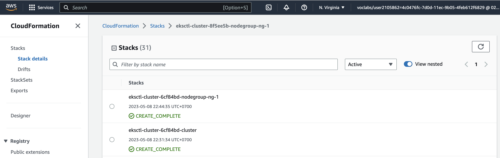
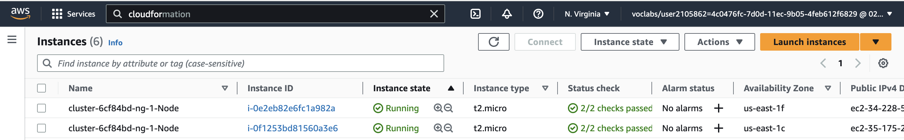
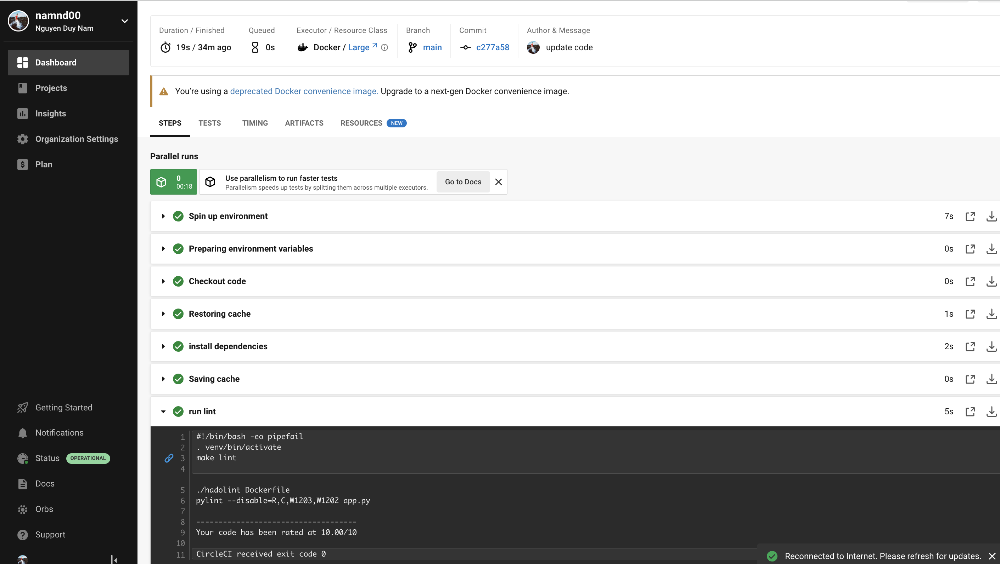

# Cloud DevOps Engineer Capstone Project

This project marks the successful culmination of the final Capstone project and the Cloud DevOps Engineer Nanodegree at Udacity.

## Introduction

Throughout the Cloud DevOps Nanodegree program, I put into practice the skills and knowledge acquired, encompassing various areas such as utilizing `Circle CI` for implementing `Continuous Integration and Continuous Deployment`, `constructing pipelines`, `deploying clusters using CloudFormation`, `creating Kubernetes clusters`, `developing Docker containers within pipelines`, and working proficiently within the `AWS environment`.

## Kubernetes Cluster

For deploying the Kubernetes Cluster, I employed AWS CloudFormation, which involved four distinct components:

- **Networking**: Establishing proper connectivity between the new nodes and the Cluster.
- **Elastic Kubernetes Service (EKS)**: Creating the Kubernetes Cluster using EKS.
- **NodeGroup**: Defining rules for operating and creating instances specific to each NodeGroup within the EKS Cluster.
- **Management**: Configuring and managing the Cluster, its deployments, and services. To ensure redundancy, I set up two management hosts, providing an extra layer of failover protection in case one of them experiences an issue.

### 1. List of deployed stacks:

### 2. List of deployed instances:

### 3. Deployed Application:

## CircleCi - CI/CD Pipelines

To facilitate the testing and deployment process, I utilized CircleCI to construct a CI/CD Pipeline. This pipeline allows for manual testing and deployment of changes, ensuring that they are thoroughly evaluated before being automatically deployed to the Cluster via cloudformation.

## Linting using Pylint and Hadolint

Linting is employed to verify the syntactic correctness of both the Application and Dockerfile. This crucial process ensures that the code maintains a high level of quality at all times.

